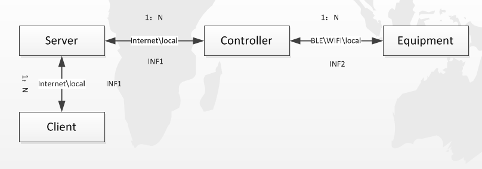
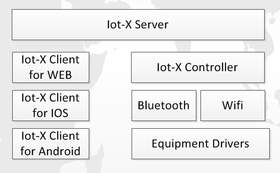

# iot-X

- **简介**
---
iot-X是一个开源的物联网软件平台，提供从设备接入、远程访问、远程控制、云服务等一整套端到端的解决方案。iot-X致力于使设备(家庭电子设备、传感器、其他终端)互联变得更加简单和灵活。

对于开发者来说，可以在iot-X上进行简单的二次开发，即可让自己的产品实现互联，并且可以定制属于自己的UI。而对于普通使用者来说，可以很方便地DIY属于自己的智能家居系统，而无须太多的专业知识。

- **系统架构及角色定义**
---
iot-X基于如下的物联网解决方案设计和开发。

**以上系统中，各角色的定义和说明如下：**

Equipment: 器件，是iot-X操作的最小对象，比如温度传感器、继电器、LED等。

Controller: 控制器，一个Controller可以管理一个或者多个Equipment，controller可以连接Server进行数据交互，并且从Server获取用户的命令，分发给Equipment。controller的实际部署可以很灵活，它既可以和Equipment部署在相同的设备上，也可以分开部署通过网络协议连接。控制器和Server配合，实现数据的订阅、分发等功能。

Client: 客户端，用户通过Client接入iot系统，实现对Equipment的数据访问和行为控制。Client可以是多种多样的，比如WEB、手机APP、PC应用程序等。可以使用iot-X提供得简单的Client，当然开发者也可以对其进行定制。

Server: 服务端，是整个系统的中心节点。提供数据存储、订阅、分发等功能。Server可以部署在Internet，也可以部署在本地局域网。

**以上系统中，各接口的定义和说明如下：**

INF1： Controller和Client都通过该接口接入Server。INF1采用RESTFul接口，同时也支持websocket协议的接口方式。

INF2： Controller和Equipment之间通过该接口通信，该接口是binary方式。

- **iot-X组件**
---

1. iot-X Server：服务端程序
2. iot-X Client：支持WEB\IOS\Android客户端
3. iot-X Controller：控制器程序，提供连接Server的接口，对下通过网络协议和Equipment连接（当然也可以部署在相同设备上）。同时提供和Server配合的功能。
4. iot-X Net：提供Ble、Wifi等连接程序。
5. Equipment Drivers：器件的驱动，iot-X提供一部分常用的，但是主要还是开发者自己提供。

- **功能描述**
---
1. Equipment注册\去注册
2. Controller注册\去注册
3. User登录\注销
4. User获取\订阅Equipment数据
5. User向Equipment发出控制命令
6. Equipment组功能

- **安全性考虑**
---
1. Controller鉴权
2. User鉴权
3. User权限分级控制
4. 权限管理组

