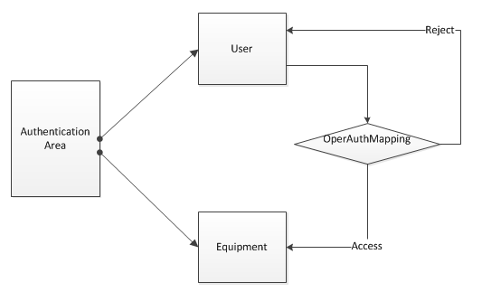

# iot-X

- **简介**
---
iot-X是一个开源的物联网软件平台，提供从设备接入、远程访问、远程控制、云服务等一整套端到端的解决方案。iot-X致力于使设备(家庭电子设备、传感器、其他终端)互联变得更加简单和灵活。

对于开发者来说，可以在iot-X上进行简单的二次开发，即可让自己的产品实现互联，并且可以定制属于自己的UI。而对于普通使用者来说，可以很方便地DIY属于自己的智能家居系统，而无须太多的专业知识。

- **系统架构及角色定义**
---
iot-X基于如下的物联网解决方案设计和开发。

**以上系统中，各角色的定义和说明如下：**

Equipment: 器件，是iot-X操作的最小对象，比如温度传感器、继电器、LED等。在实际的实现中，我们支持将equipments划分为器件组(EquipmentGrp)，这样对于Controller下面器件过多的场景，可以通过器件组使管理更加方便。

Controller: 控制器，一个Controller可以管理一个或者多个Equipment，controller可以连接Server进行数据交互，并且从Server获取用户的命令，分发给Equipment。controller的实际部署可以很灵活，它既可以和Equipment部署在相同的设备上，也可以分开部署通过网络协议连接。控制器和Server配合，实现数据的订阅、分发等功能。

Client: 客户端，用户通过Client接入iot系统，实现对Equipment的数据访问和行为控制。Client可以是多种多样的，比如WEB、手机APP、PC应用程序等。可以使用iot-X提供得简单的Client，当然开发者也可以对其进行定制。

Server: 服务端，是整个系统的中心节点。提供数据存储、订阅、分发等功能。Server可以部署在Internet，也可以部署在本地局域网。

**以上系统中，各接口的定义和说明如下：**

INF1： Controller和Client都通过该接口接入Server。INF1采用RESTFul接口，同时也支持websocket协议的接口方式。

INF2： Controller和Equipment之间通过该接口通信，该接口是binary方式。

- **iot-X组件**
---

1. iot-X Server：服务端程序
2. iot-X Client：支持WEB\IOS\Android客户端
3. iot-X Controller：控制器程序，提供连接Server的接口，对下通过网络协议和Equipment连接（当然也可以部署在相同设备上）。同时提供和Server配合的功能。
4. iot-X Net：提供Ble、Wifi等连接程序。
5. Equipment Drivers：器件的驱动，iot-X提供一部分常用的，但是主要还是开发者自己提供。

- **功能描述**
---
1. Equipment注册\去注册
2. Controller注册\去注册
3. User登录\注销\注册\去注册
4. User获取\订阅Equipment数据
5. User向Equipment发出控制命令
6. Equipment组功能

- **安全性考虑**
---
iot-X提供一整套机制来保证设备数据的安全性。

安全性机制主要从两个方面来考虑，一是接入的鉴权，二是操作权限的控制。

***接入鉴权***

iot-X提供三种接入场景，设备接入、用户接入和第三方APP接入。

> **设备接入**
> 
> equipment通过controller接入server。我们认为经过鉴权的controller下的所有equipment都是安全的，所以，设备接入的鉴权其实是针对controller的鉴权。
> 
> controller通过key值的方式进行鉴权。一个controller被添加到server以后，会自动分配一个随机的key值，后续controller接入需要携带该key值进行鉴权。

> **用户接入**
>
> 用户接入采用HTTP基本的鉴权方式，用户名和密码。新用户注册时指定用户名和密码，后续登录时进行验证。
> 
> **第三方APP接入**
> 
> 第三方APP接入是非常有用的一个场景，比如，可以在你自己的网站或者手机APP上实时显示某个传感器的数据。它也是采用了key值的方式进行鉴权。第三方APP在注册时，server会自动生成一个随机key值，后续通过该key值进行鉴权。

***操作权限控制***

操作权限划分为：监视(0x1)、控制(0x3)、管理(0x7)、超级管理(0xf)。权限的等级依次变大，后者自然包含前者的所有权限。括号中的数值是该权限对应的值，按位使用。所有的API接口都会指定一个操作权限，只有拥有不低于该操作权限的用户才能调用该API。
> 监视 ： 即设备数据的访问权限。
> 
> 控制 ： 即对设备的控制权限，主要是对设备发送控制命令的权限。
> 
> 管理 ： 对象的创建、删除、监视、控制等。一般某个对象的创建者拥有其管理权限
> 
> 超级管理 ： 最高权限，针对所有对象拥有管理权限，一个系统仅有一个。

iot-X通过认证域的方式来实现用户操作权限的控制。

**认证域(AuthorationArea)**：认证域中包含了一组Equipment以及对其具有操作权限的用户组，以下是它的json描述。

            "resAuthenticationArea": {
            "type": "object",
            "description": "认证域的结构定义",
            "properties": {
                "id": {
                    "type": "string",
                    "description": "认证域ID"
                },
                "name": {
                    "type": "string",
                    "description": "认证域名称"
                },
                "description": {
                    "type": "string",
                    "description": "认证域描述"
                },
                "key": {
                    "type": "string",
                    "description": "认证域的key，一个device如果要注册在该认证域，则需要携带相同的key值。同样，一个用户要添加到认证域，也需要携带key。"
                },
                "deviceslist": {
                    "type": "array",
                    "description": "该认证域中的所有设备对象",
                    "items": {
                        "type": "string",
                        "description": "设备对象ID"
                    }
                },
                "userslist": {
                    "type": "array",
                    "description": "该认证域中的所有用户",
                    "items": {
                        "type": "string",
                        "description": "用户ID"
                    }
                }
           

**操作权限映射(OperAuthMapping，OAMapping)**，用来表示一组操作权限。它关联Equipment和用户，用来指定某个用户对该Equipment所具备的操作权限。

1. Controller鉴权
2. User鉴权
3. User权限分级控制
4. 权限管理组

